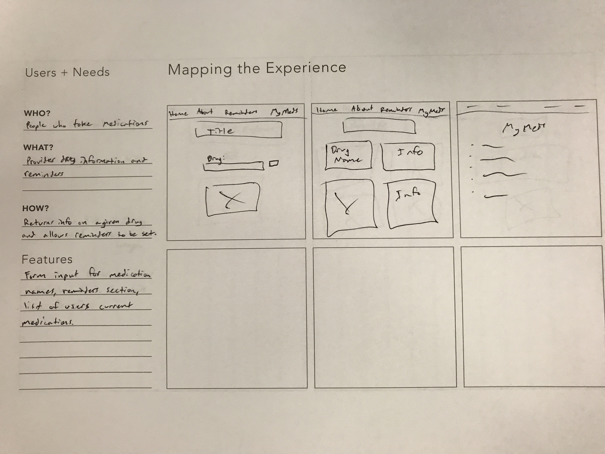

## Project Description
**DrugDominate**
An app that you can input any medication you are taking and it will give you a list of interactions it may have, as well as remind you when to take them.

## What problem does your project solve?
Many people forget when to take their medications, and do not know what other meds/food they should avoid to prevent drug interactions.

## Who has this problem?
Many people on medication.

## How will your project solve this problem?
It will remind people when they need to take their medications, and also inform them of any interactions that may occur.  

## What inputs does it need?
A form to input medication names, as well as frequency.

## What outputs does it produce?
It will display drug information, including uses and interactions, as well as remind the user when to take their medication.

## What web API(s) will it use?
Either rxnav or another drug api.

## What technologies do you plan to use?
HTML, CSS, Javascript, Bootstrap, Firebase

## Feature list
Form input, reminders section, current medication list

# Q1-project-DrugDominate
